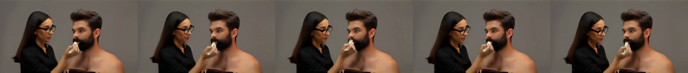

# RDD Video + C2F

[Video page](README_RDD.html) · [Diff viewer source](rdd/review.py) · [Training details](rdd/TRAINING.md)

The HTML video page is for local viewing; on GitHub use the individual video links below. To generate the local diff page, run `python rdd/review.py`.

## Implementation

RDD reuses the Wan backbone at increasing resolutions. It changes the flow path and velocity target; stage transitions recover clean latents, upsample, and apply noise filling.

| Added file | Function |
|---|---|
| [rdd/flow.py](rdd/flow.py) | RDD path, velocity target, clean recovery, noise filling |
| [rdd/finetune.py](rdd/finetune.py) | Wan training adapter and continuous Euler sampler |
| [rdd/train.py](rdd/train.py) · [config](rdd/wan_finetune_300300400.yaml) | Official Trainer integration and hyperparameters |
| [rdd/dense_c2f.py](rdd/dense_c2f.py) | C2F self-attention hook for the finetuned, non-VSA Wan |
| [rdd/sample_finetuned_c2f.py](rdd/sample_finetuned_c2f.py) | Paired sampling and repeated timing |
| [rdd/attention.py](rdd/attention.py) | Legacy FastWan/VSA C2F controller and route utilities |
| [rdd/sampler.py](rdd/sampler.py) · [run.py](rdd/run.py) | Legacy DMD3 sampling; separate from Euler50 |

Legacy FastWan/DMD3 usage: [inference guide](rdd/LEGACY_INFERENCE.md).

Official `fastvideo/` and `fastvideo-kernel/` remain unchanged from `fastvideo-base` (`2413a576`). No new prediction head or learned transition.

## Finetune

We finetune the original **Wan2.1-T2V-1.3B** with the RDD flow-matching objective, updating the full Transformer.

| Training | Configuration |
|---|---|
| Base | `Wan-AI/Wan2.1-T2V-1.3B-Diffusers`; non-DMD |
| Data | Mixkit preencoded latents; 384 train / 32 held-out clips |
| Parameters | Full Transformer; frozen T5/VAE; dense FlashAttention |
| Loss | Drift-aware velocity MSE; uniform time sampling |
| Optimizer | AdamW; LR 1e-5; 100-step warmup |
| Batch | 8-GPU FSDP; 1/GPU × accumulation 2 = global 16 |
| Precision | FP32 master/residual; BF16 mixed compute |
| Updates | 5,003; before/after preview at 0 / 5,000 |

| Stage | Low | Middle | High |
|---|---:|---:|---:|
| Factor `(spatial, temporal)` | (4,1) | (2,1) | (1,1) |
| Latent `T×H×W` | 8×14×26 | 8×28×52 | 8×56×104 |
| Tokens | 728 | 2,912 | 11,648 |
| Data-time interval | 0–0.4 | 0.4–0.7 | 0.7–1 |
| Euler updates | 20 | 15 | 15 |

| Sampling | Configuration |
|---|---|
| Output | 832×448; 29 frames; 16 fps |
| Schedule | Euler50 + 2 boundary evaluations; CFG5; flow shift 1 |
| Model calls | 104, including conditional/unconditional branches |
| Transition | Clean prediction → nearest upsample → fresh IID noise |
| Seed | 20260926 |

`300/300/400` denotes high/middle/low time allocation. **1,000 is the model's time scale, not the sampling step count.**

### Results

Same prompt, seed and sampler; only weights change. Both sides use RDD with dense attention, without C2F.

<button type="button" data-pair-action="restart">Play both from start</button> <button type="button" data-pair-action="pause">Pause both</button>

<figure><figcaption><strong>Before finetune</strong> 0 updates · Original Wan + RDD</figcaption><video controls muted playsinline preload="metadata" poster="rdd_media/training/rdd_before.png" src="rdd_media/training/rdd_before.mp4"></video></figure>
<figure><figcaption><strong>After finetune</strong> 5,000 updates · Finetuned Wan + RDD</figcaption><video controls muted playsinline preload="metadata" src="rdd_media/training/rdd_after_5000.mp4"></video></figure>

Play both from the start, or use individual controls.

[Before](rdd_media/training/rdd_before.mp4) · [After](rdd_media/training/rdd_after_5000.mp4) · Metadata: [before](rdd_media/training/rdd_before.json) / [after](rdd_media/training/rdd_after_5000.json)

Recognizable composition replaces color blocks. Hand/face artifacts and limited motion remain; this example is not a generalization benchmark.

Original full-resolution Wan reference

<video controls playsinline preload="none" width="720" poster="rdd_media/training/original_full.png" src="rdd_media/training/original_full.mp4"></video>

Original weights; Euler50 / CFG5 / flow shift 1; 100 model calls. Not an optimized official Wan sampler.

## C2F

Use each stage's endpoint Q/K to select block routes for the next stage. Recompute current Q/K/V and sparse attention every step.

| Component | Configuration |
|---|---|
| Hook | Self-attention after RoPE; cross-attention/MLP unchanged |
| Low stage | Dense |
| Routing | Mean-pool Q/K in 4×4×4-token tiles → block QK → Top-K |
| Transfer | Custom Triton route lift: parent links → child-block indices |
| Refresh | Low endpoint guides middle; middle endpoint guides high |
| Cache | Routes only; separate per layer/head/CFG branch; fixed within a stage |
| Keep fraction | 50%, 30%, 20%, 12.5%; self block included |
| Actual keep at requested 20% | Middle 24.86%; high 22.03% of block pairs |
| Weights | Checkpoint-5003; **no C2F finetuning** |

No cached attention probabilities or AV outputs. Route construction still runs at stage endpoints.

### Kernels

| File | Ownership / operation | Used below |
|---|---|---|
| [route_lift.py](rdd/kernels/route_lift.py) | **Custom Triton**: coarse routes → compact fine indices/counts | Yes |
| [block_sparse_attn.py](fastvideo-kernel/python/fastvideo_kernel/block_sparse_attn.py) → [Triton executor](fastvideo-kernel/python/fastvideo_kernel/triton_kernels/block_sparse_attn_triton.py) | **Unmodified upstream**: selected QK, softmax, AV | Yes |
| [smallq.py](rdd/kernels/smallq.py) | Custom Triton: 16/32-token query tiles | No; legacy option |
| [noise_filling.py](rdd/kernels/noise_filling.py) | Custom Triton: fused upsample/noise blend | No; legacy option |

### Results

**Baseline: finetuned dense RDD, not VSA.** Same sampling configuration as above.

| Keep | Denoise, s | Latency reduction | +VAE, s | Total reduction | Visual result |
|---|---:|---:|---:|---:|---|
| Dense | 14.582 | Baseline | 16.027 | Baseline | Reference |
| 50% | 14.967 | −2.64% | 16.412 | −2.40% | Closest; slower |
| 30% | 14.229 | 2.42% | 15.673 | 2.21% | Local distortion |
| 20% | 13.917 | 4.56% | 15.361 | 4.16% | Structural artifacts |
| 12.5% | 13.582 | 6.86% | 15.026 | 6.25% | Severe artifacts |

| Timing protocol | Value |
|---|---|
| Hardware | Single RTX PRO 6000 Blackwell Server Edition |
| Repeats | 1 warmup/method; 5 interleaved rounds; median |
| Included | Denoising, boundary/route work; VAE in total |
| Excluded | Loading, text encoding, initial compilation, MP4 export |
| Scope | Makeup prompt timing; 3 prompts for visual inspection |

[Raw timing](rdd_media/evidence/finetuned_c2f_timing.json). Reduction = `1 − method/baseline`; negative means slower. No demonstrated quality-preserving 10–20% gain; no FVD/VBench evaluation.

Each grid: **top-left dense; top-right 50%; bottom-left 20%; bottom-right 12.5%.**

#### Makeup

<video controls playsinline preload="none" width="832" poster="rdd_media/c2f/prompt0/comparison.jpg" src="rdd_media/c2f/prompt0/comparison.mp4"></video>

[Dense](rdd_media/c2f/prompt0/dense.mp4) · [50%](rdd_media/c2f/prompt0/c2f50.mp4) · [30%](rdd_media/c2f/prompt0/c2f30.mp4) · [20%](rdd_media/c2f/prompt0/c2f20.mp4) · [12.5%](rdd_media/c2f/prompt0/c2f12.mp4) · [Config](rdd_media/c2f/prompt0/metrics.json)

#### Dog

<video controls playsinline preload="none" width="832" poster="rdd_media/c2f/prompt11/comparison.jpg" src="rdd_media/c2f/prompt11/comparison.mp4"></video>

[Dense](rdd_media/c2f/prompt11/dense.mp4) · [50%](rdd_media/c2f/prompt11/c2f50.mp4) · [30%](rdd_media/c2f/prompt11/c2f30.mp4) · [20%](rdd_media/c2f/prompt11/c2f20.mp4) · [12.5%](rdd_media/c2f/prompt11/c2f12.mp4) · [Config](rdd_media/c2f/prompt11/metrics.json)

#### Bedroom

<video controls playsinline preload="none" width="832" poster="rdd_media/c2f/prompt24/comparison.jpg" src="rdd_media/c2f/prompt24/comparison.mp4"></video>

[Dense](rdd_media/c2f/prompt24/dense.mp4) · [50%](rdd_media/c2f/prompt24/c2f50.mp4) · [30%](rdd_media/c2f/prompt24/c2f30.mp4) · [20%](rdd_media/c2f/prompt24/c2f20.mp4) · [12.5%](rdd_media/c2f/prompt24/c2f12.mp4) · [Config](rdd_media/c2f/prompt24/metrics.json)

## Historical Benchmark

**FastWan DMD3, not the finetuned Euler50 model.** Same model, VSA20, resident execution; 5 warmups + 30 interleaved rounds; 832×448×29. No VAE timing.

### RDD vs. Fixed Resolution

| Spatial factors | Denoise + boundary, s | Speedup | Latency reduction |
|---|---:|---:|---:|
| 1→1→1 | 0.8550 | 1.00× | 0% |
| 2→2→1 | 0.4214 | 2.03× | 50.71% |
| 4→2→1 | 0.4135 | 2.07× | 51.64% |
| 4→4→1 | 0.4041 | 2.12× | 52.74% |

These weights were **not RDD-finetuned**; timings do not establish equal-quality speedup. A matched full-resolution benchmark for the new finetuned Euler50 model remains unmeasured.

### C2F vs. VSA

| Spatial factors | RDD + VSA20, s | RDD + legacy C2F, s | Latency reduction |
|---|---:|---:|---:|
| 2→2→1 | 0.42141 | 0.41223 | 2.18% |
| 4→2→1 | 0.41347 | 0.41290 | 0.14% |
| 4→4→1 | 0.40412 | 0.39634 | 1.93% |

[Raw benchmark](rdd_media/evidence/historical_dmd3_paired.json).

| Limitation | Explanation |
|---|---|
| Unfair legacy comparison | `c2f_route_only` removed VSA's coarse-output branch; keep ratios also differed (~25% vs.20% for 421) |
| Coarse output | VSA uses `softmax(QcKcᵀ/√d)Vc` in its gated output; retaining it requires current coarse attention |
| Small savings | Block-level routing is relatively cheap; projections, MLP, selected QK/AV and VAE remain |
| Added overhead | Route mapping, packing, padding and kernel launches offset savings |
| Quality | Fixed coarse routes can miss new details and become stale |

These records do **not** establish a fair, quality-preserving advantage over VSA. The current non-VSA Wan has no coarse-output branch to remove.

## Code & Data

| Resource | Location |
|---|---|
| Full training configuration | [YAML](rdd/wan_finetune_300300400.yaml) |
| Inference instructions | [FINETUNED_C2F.md](rdd/FINETUNED_C2F.md) |
| Final checkpoint | `checkpoint-5003`; weights/data are not included in this repository |
| Media / evidence | `rdd_media/` · [SHA256 manifest](rdd_media/asset_manifest.json) |
| Diff | `git diff fastvideo-base HEAD`; fetch the `fastvideo-base` tag for the pinned upstream comparison |

Training-preview timings are not used as inference benchmarks.
